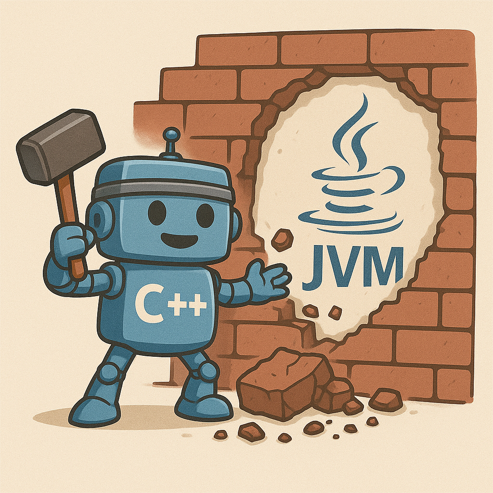

# X-JVM - C++实现的Java虚拟机

**作者**: zhukovasky  
**项目名称**: zhukovasky的Java虚拟机  
**开发语言**: C++14  
**构建系统**: CMake  
**支持平台**: Windows, Linux, macOS

## 项目简介

X-JVM是一个用C++14编写的Java虚拟机实现，目标是能够解析、加载和执行Java字节码。该项目实现了JVM的核心组件，包括类文件解析、运行时环境、指令执行引擎和内存管理等功能。

## 项目架构

### 核心模块

#### 1. 类文件解析 (`classfile/`)
- **ClassFile**: Java类文件解析器
- **ConstantPools**: 常量池解析
- **MethodInfo/FieldInfo**: 方法和字段信息解析
- **AttributeInfo**: 属性信息解析（支持多种属性类型）
- 支持完整的Java类文件格式规范

#### 2. 运行时环境 (`runtime/`)
- **ClassLoader**: 类加载器，支持Bootstrap和用户类路径
- **JavaThread**: Java线程实现
- **ThreadPool**: 线程池管理
- **JavaFrame**: 栈帧实现
- **OperandStack**: 操作数栈
- **LocalVariableTables**: 本地变量表
- **Slots**: 变量槽位管理

#### 3. 堆内存管理 (`runtime/heap/`)
- **JavaClass**: 运行时类表示
- **JavaHeap**: 堆内存管理
- **Object**: Java对象模型
- **StringConstantPools**: 字符串常量池
- **MethodDescriptor**: 方法描述符解析
- **ClassMember**: 类成员管理
- **RuntimeConstantsPool**: 运行时常量池

#### 4. 垃圾回收 (`runtime/gc/`)
- **GarbageCollector**: 垃圾回收器框架
- **GCThreadPool**: GC专用线程池
- 支持标记-清除算法基础框架

#### 5. 指令执行 (`instructions/`)
- **InstructionFactory**: 指令工厂
- **常量指令** (`constants/`): NOP, CONST, LDC, BIPUSH, SIPUSH等
- **加载指令** (`load/`): ILOAD, ALOAD等变体
- **存储指令** (`store/`): ISTORE, ASTORE等变体
- **算术指令** (`maths/`): IADD等算术运算
- **栈操作指令** (`stack/`): DUP等栈操作
- **控制流指令** (`control/`): RETURN, GOTO等
- **引用指令** (`reference/`): NEW, GETSTATIC, INVOKESTATIC等
- **比较指令** (`comparisons/`): 各种比较操作

#### 6. 字节码解释器 (`interpret/`)
- **Interpret**: 字节码解释执行引擎
- **ByteCodeReader**: 字节码读取器
- 支持循环执行Java方法

#### 7. 工具类 (`utils/`)
- **FileUtils**: 文件操作工具
- **StringUtils**: 字符串处理工具
- **ZipUtils**: ZIP文件处理（支持JAR文件）

## 🚀 跨平台编译和运行

### 系统要求
- **通用**: CMake 3.12+, C++14编译器, Git
- **Windows**: Visual Studio 2017+ 或 MinGW
- **Linux**: GCC 7+ 或 Clang 6+
- **macOS**: Xcode 10+ 或 Homebrew GCC

### 依赖项
- **Boost库**: system, filesystem, program_options (≥1.65)
- **zlib库**: 用于ZIP/JAR文件处理

## 🖥️ Windows 编译

### 快速开始
```cmd
# 1. 安装依赖
setup-deps.bat

# 2. 编译项目
build.bat

# 3. 运行测试
run-example.bat Hello.class
```

### 详细选项
```cmd
# 批处理脚本
build.bat --debug          # Debug构建
build.bat --clean          # 清理后构建

# PowerShell脚本 (推荐)
.\build.ps1                               # Release构建
.\build.ps1 -BuildType Debug              # Debug构建
.\build.ps1 -Clean -InstallDeps           # 清理、安装依赖并构建
.\build.ps1 -Generator "MinGW Makefiles"  # 使用MinGW
```

### 手动编译 (Windows)
```cmd
# 使用vcpkg安装依赖
git clone https://github.com/Microsoft/vcpkg.git
cd vcpkg && .\bootstrap-vcpkg.bat
vcpkg install boost-system boost-filesystem boost-program-options zlib --triplet x64-windows
vcpkg integrate install

# 编译项目
mkdir build && cd build
cmake .. -DCMAKE_TOOLCHAIN_FILE=C:\vcpkg\scripts\buildsystems\vcpkg.cmake
cmake --build . --config Release
```

## 🐧 Linux 编译

### 快速开始
```bash
# 给脚本添加执行权限
chmod +x build.sh

# 1. 安装依赖并编译
./build.sh -i

# 2. 或者分步骤
./build.sh -i        # 仅安装依赖
./build.sh           # 编译项目
```

### 详细选项
```bash
./build.sh -h                    # 显示帮助
./build.sh -t Debug              # Debug构建
./build.sh -c -t Release         # 清理后Release构建
./build.sh -g Ninja -j 8         # 使用Ninja构建器，8个并行任务
./build.sh -v                    # 详细输出
```

### 手动编译 (Linux)
```bash
# Ubuntu/Debian
sudo apt update
sudo apt install -y libboost-all-dev zlib1g-dev cmake build-essential

# CentOS/RHEL
sudo yum install -y boost-devel zlib-devel cmake gcc-c++ make

# Fedora
sudo dnf install -y boost-devel zlib-devel cmake gcc-c++ make

# Arch Linux
sudo pacman -S boost zlib cmake gcc make

# 编译项目
mkdir build && cd build
cmake .. -DCMAKE_BUILD_TYPE=Release
cmake --build . -j$(nproc)
```

## 🍎 macOS 编译

### 快速开始
```bash
# 给脚本添加执行权限
chmod +x build.sh

# 1. 安装依赖并编译
./build.sh -i

# 2. 或者使用Homebrew手动安装
brew install boost zlib cmake
./build.sh
```

### 手动编译 (macOS)
```bash
# 安装Homebrew (如果没有)
/bin/bash -c "$(curl -fsSL https://raw.githubusercontent.com/Homebrew/install/HEAD/install.sh)"

# 安装依赖
brew install boost zlib cmake

# 编译项目
mkdir build && cd build
cmake .. -DCMAKE_BUILD_TYPE=Release
cmake --build . -j$(sysctl -n hw.ncpu)
```

## 🔧 CMake 配置选项

本项目的CMakeLists.txt已经过跨平台优化，支持以下特性：

- **自动平台检测**: 自动检测Windows/Linux/macOS并应用相应配置
- **智能依赖查找**: 优先使用系统库，回退到内置库
- **编译器适配**: 自动适配MSVC/GCC/Clang编译器
- **多构建类型**: Release/Debug/RelWithDebInfo/MinSizeRel
- **并行构建**: 自动检测CPU核心数
- **IDE集成**: 支持Visual Studio和Xcode项目生成

### 高级构建选项
```bash
# 使用特定生成器
cmake .. -G "Visual Studio 16 2019"  # Windows
cmake .. -G "Xcode"                   # macOS
cmake .. -G "Ninja"                   # 跨平台

# 指定构建类型
cmake .. -DCMAKE_BUILD_TYPE=Debug

# 指定安装路径
cmake .. -DCMAKE_INSTALL_PREFIX=/usr/local

# 使用特定的Boost版本
cmake .. -DBOOST_ROOT=/path/to/boost
```

### 运行方式
```bash
# Linux/macOS
./jvm --xjre /path/to/jre --classpath . --javaclass Hello.class

# Windows
jvm.exe --xjre "C:\Program Files\Java\jdk-11\jre" --classpath . --javaclass Hello.class
```

### 参数说明
- `--xjre`: JRE主目录路径
- `--classpath`: 用户类路径
- `--javaclass`: 要执行的Java类文件名（必须以.class结尾）
- `--help`: 显示帮助信息

### 🔧 故障排除

**常见问题:**

1. **CMake找不到Boost库**:
   - **Windows**: 使用vcpkg或设置`BOOST_ROOT`环境变量
   - **Linux**: 安装`libboost-all-dev`或`boost-devel`
   - **macOS**: 运行`brew install boost`

2. **编译器错误**:
   - 确保C++14兼容编译器（GCC 7+, Clang 6+, MSVC 2017+）
   - 检查PATH环境变量

3. **zlib未找到**:
   - 项目包含内置zlib，通常会自动回退使用
   - 手动安装：`apt install zlib1g-dev` (Ubuntu) 或 `brew install zlib` (macOS)

4. **权限问题** (Linux/macOS):
   ```bash
   chmod +x build.sh
   ```

## 支持的JVM特性

### ✅ 已实现功能
1. **类文件解析**: 完整支持Java类文件格式
2. **常量池解析**: 支持所有常量池项类型
3. **类加载**: 支持Bootstrap类路径和用户类路径
4. **基础指令**: 支持常见的JVM指令（约50+条）
5. **栈帧管理**: 完整的栈帧、操作数栈、本地变量表实现
6. **方法调用**: 支持静态方法调用
7. **对象创建**: 基础的对象实例化
8. **内存管理**: 基础堆内存分配
9. **多线程**: 线程池和Java线程抽象

### 🚧 部分实现功能
1. **垃圾回收**: 框架已搭建，具体算法待实现
2. **异常处理**: 异常框架存在，处理逻辑不完整
3. **本地方法**: 接口定义完成，具体实现待补充

## 项目特色

1. **现代C++**: 使用C++14标准，充分利用现代C++特性
2. **跨平台设计**: 原生支持Windows、Linux、macOS三大平台
3. **模块化架构**: 清晰的模块划分，便于理解和维护
4. **智能构建**: 自动检测依赖和平台配置
5. **多编译器支持**: 支持MSVC、GCC、Clang
6. **自动化脚本**: 提供完整的构建和部署脚本
7. **标准兼容**: 严格按照JVM规范实现

## 开发状态

这是一个学习型项目，主要用于理解JVM内部工作原理。目前可以执行简单的Java程序，但还不是一个完整的生产级JVM。

**完成度约45%** - 适合学习JVM内部机制的参考项目

## 许可证

[LICENSE文件](LICENSE)

## 贡献

欢迎提交Issue和Pull Request来改进这个项目。

支持的平台和工具链：
- **Windows**: Visual Studio, MinGW, CLion
- **Linux**: GCC, Clang, Qt Creator, CLion
- **macOS**: Xcode, GCC (Homebrew), CLion

---

**注意**: 这是一个教育性质的JVM实现，主要用于学习JVM内部机制，不建议用于生产环境。
